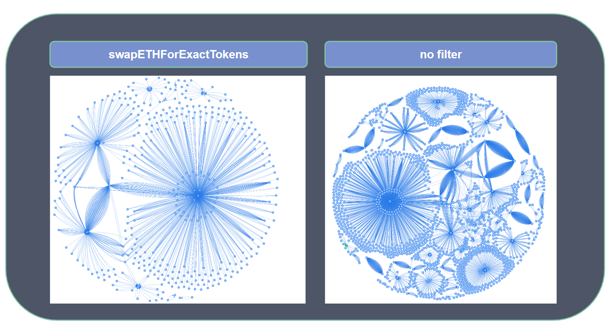
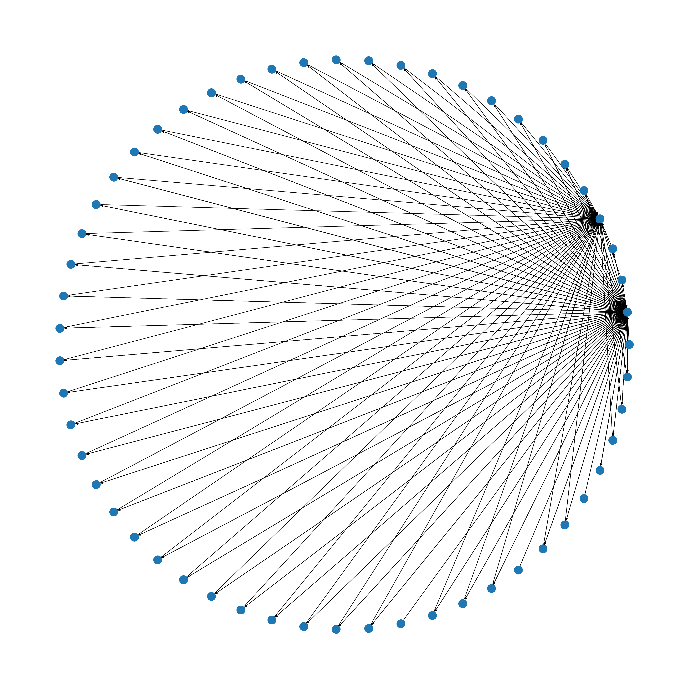

# Harmony Bot Detection

This scuffed repo is a loose collection of scripts for a university project that helped in finding out more about the use of sniping bots on the harmony blockchain.

### Introduction

The kind of initial token offering that is most susceptible to sniping bot attacks is the so called "fair launch". It works by supplying a market for the token at a predetermined point in time making it possible to set up scripts that buy before masses buy and sell right after. Ironically the exposure to bots makes it everything but fair.
Tokens on Harmony are usually bought on Decentralised Exchanges (DEX) which hold a number of liquidity pools.
A liquidity pool consists out of a pair (token1, token2) and makes it possible to convert one token into the other at a rate that is determined by the ratio of that token in the pool.

### Data Collection

- Collect the biggest DEXes - Manually collected in `data/setting/exchanges.json`
- Collect the time when the token was launched with `get_pair_created_transactions.py`
- Collect the token pairs traded per DEX with `get_pairs.py`, saved in `data/setting/pairs.json`
  - `get_pair_info.py` creates a json file `pair_to_info.json` so one can look up the tokens involved in a pair
- `get_times.py` and `get_swaps.py` : As we know when the tokenpair was created, we can try to look up when liquidity was deposited in the pool
and which swaps were done after the liquidity was added
- `get_info_on_swaps.py` For each swap we get when it was mined, the value etc.
- General strategy for each pair:
    - grab the block it was created by looking at the transaction that created the pair contract
    - Look k blocks into the future for Mint/Burn events on the pool token contract to see liquidity events
    - Collect the first n minutes of trading data after liquidity was first provided

### Heuristic
We implemented one graph based heuristic that detects a special type of snipe we named "spam snipe"
It looks for a structure of a distributor that sends tokens to a lot of addresses and then a lot of addresses that send 
transactions to the same contract which has the purpose to try buying a certain token every time it is called.
The following is an example for the structure we are looking for
